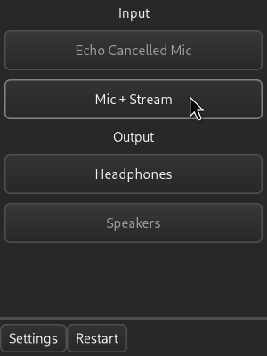

# audio-select

Simple configurable GUI application to quickly switch default sink and source
for your PulseAudio deamon.

### Configurability

Audio-select uses `libpulse-binding` to get the lists of active pulseaudio sinks
and sources, so any virtual devices and their "`.monitor`"s will appear (some
apps don't show these monitor devices limiting overall configurability). There's
also a UI for hiding or labeling some of these devices with an option to save a
toml file to the correct config folder.

### Windowing

The app opens up right under or above your mouse so it can easily integrate
with standalone toolbars like i3blocks.

### Screenshot

